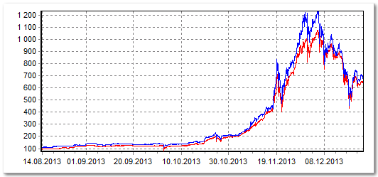

## An AWS Lambda function that looks for Bitcoin Arbitrage opportunities


This is a simple **AWS Lambda function** that finds interesting **arbitrage opportunities for cryptocurrencies**. At the moment there are only two exchanges with relatively different volumes ([Kraken](https://kraken.com) and [BitStamp](https://bitstamp/com)). It runs every 10 (you can setup your interval) minutes.

### What is arbitrage

In order to buy/sell cryptocurrencies we need to be in a market. This market is called [Exchange](https://en.wikipedia.org/wiki/Digital_currency_exchange). We assume that there are different markets that let people trade the same digital assets. Due to market inefficiencies and difference of trading volume between each other, the price for the same digital asset can be different from an exchange to another. This is true in traditional markets (like New York Stock Exchang vs London Stock Exchang, others...), but is as well in crypto currencies markets (like Kraken and Bitstamp, others...).

Now I am Bob and I want to buy 1 BTC in the exchange A, the price in there is 1BTC=3672$. I am Bob and I can also buy 1 BTC on exchange B, the price in there is 1BTC=3630$. Now what I can do is buying 1 BTC at exchange B and sell the same 1BTC at exchange A. This is called arbitrage.

> Arbitrage is the simultaneous purchase and sale of an asset to profit from a difference in the price. It is a trade that profits by exploiting the price differences of identical or similar financial instruments on different markets or in different forms. Arbitrage exists as a result of market inefficiencies. -- [Investopedia](http://www.investopedia.com/terms/a/arbitrage.asp#ixzz4tS44jciY)

An Example of BTC price in two different exchanges. Basically with this lambda function we look at the price difference between the red and the blue line. When this difference is large enough (like 3%), we buy a fixed sum in the red exchange and we sell on the blue exchange.



### What this lambda function does

This script pulles the exchange rates of BTCEUR (or a list of currencies you want) every 10 minutes and whenever it detects a spread of at least 3% (you can choose your spread level) between the two rates it tries to buy on the cheapest exchange and sell on the more expensive one. It will text you in case of success (or failure)

### Assumptions and constraints
- You need to have two verified accounts in both (or how many exchange you want to do arbitrage on)
- Both accounts (or more) must have funds (BTC, EUR or whatever assets you want to arbitrage on)
- The spread can change quickly, but the transactions can get approved with dealy which would cause you potential losses

### Disclaimer

Past performance is not necessarily indicative of future results. Use this software at your own risk.

### Setup the function

In order to get started you just have to use [serverless](http://serverless.com)

```sh
$ serverless install --url https://github.com/0x13a/bitcoin-arbitrage --name my-btc-arbitrage
```

In order to deploy to your AWS Lambda function (or other serverless platform if you like) you need to follow this guide [https://serverless.com/framework/docs/providers/aws/guide/functions/](https://serverless.com/framework/docs/providers/aws/guide/functions/). Sorry, if for the moment it looks too cumbersome to configure, i will make a better readme.

### Configuration file

This is an example of configuration file for `serverless.yml`. In my case I've used [kraken](https://kraken.com) and [Bitstamp](https://bitstamp.com). So you will need to recover API access keys from there in order to automate the trades.

Unless you want to use this in another serverless service (Google Cloud Functions, IBM OpenWhisks, etc). You need to configure your AWS Lambda function to access your Amazon SNS.

```sh
service: bitcoin-arbitrage

# Use the serverless-webpack plugin to transpile ES6
plugins:
  - serverless-webpack

# Enable auto-packing of external modules
custom:
  webpackIncludeModules: true

provider:
  name: aws
  runtime: nodejs6.10
  iamRoleStatements:
    - Effect: "Allow"
      Action:
          - "sns:Publish"
          - "sns:Subscribe"
      Resource: { "Fn::Join" : ["", ["arn:aws:sns:${aws-region}:", { "Ref" : "${aws-account-id}" }, ":${aws-arn}" ] ]  }

functions:
  watch:
    handler: handler.watch
    environment:
        KRAKEN_KEY: ${kraken-key}
        KRAKEN_SECRET: ${kraken-secret}
        BITSTAMP_KEY: ${bitstamp-key}
        BITSTAMP_SECRET: ${bitstamp-secret}
        BITSTAMP_CLIENT_ID: ${bitstamp-client-id}
        ASSET: BTCEUR
        AMOUNT: 100EUR
        SNS_TOPIC_ARN: ${sns-topic-arn}
        SNS_REGION: ${sns-region}
        SPREAD_THRESHOLD: "3"
    events:
        - schedule: cron(10 * * * ? *)
    timeout: 50
```

### It text you when you make profit or when something goes wrong

Thanks to the integration of [Amazon SNS](https://aws.amazon.com/sns) the lambda function communicate with the amazon notification systema and it's able to send you a text message when something goes wrong or when the function succeed to make a profitable arbitrage operation
